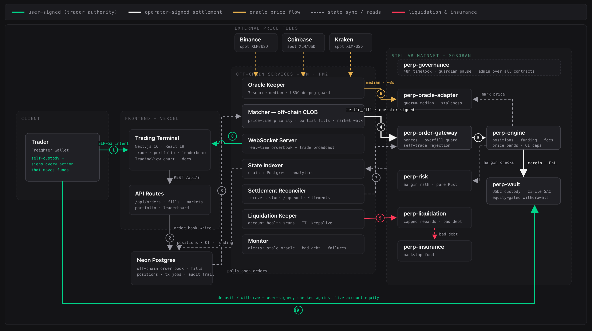
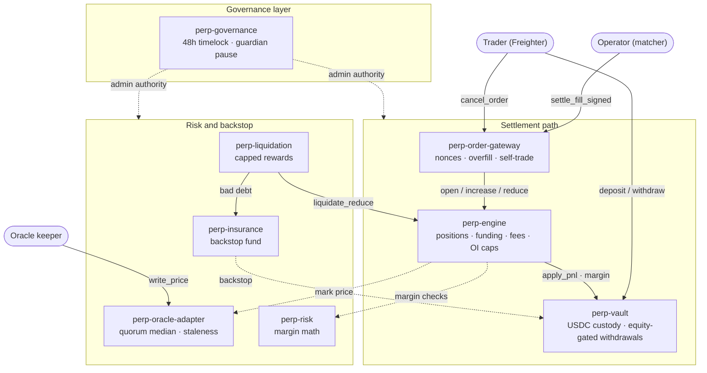
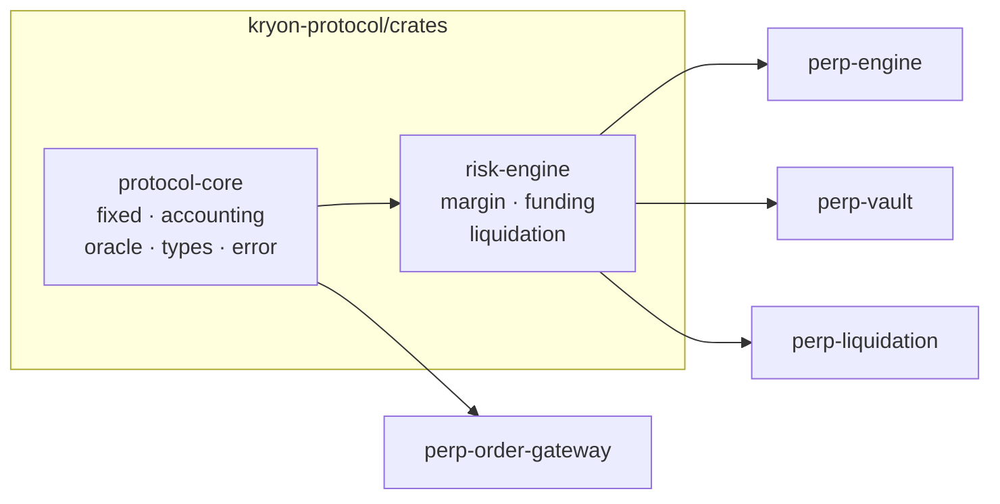
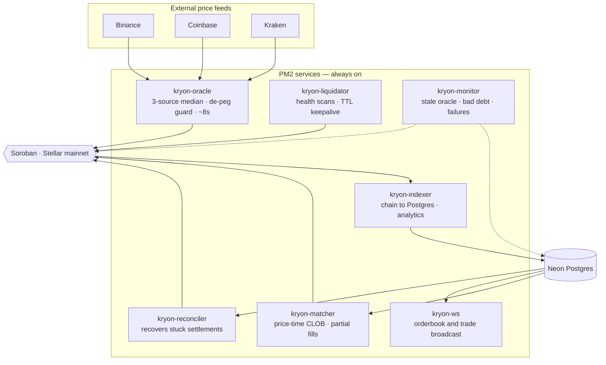
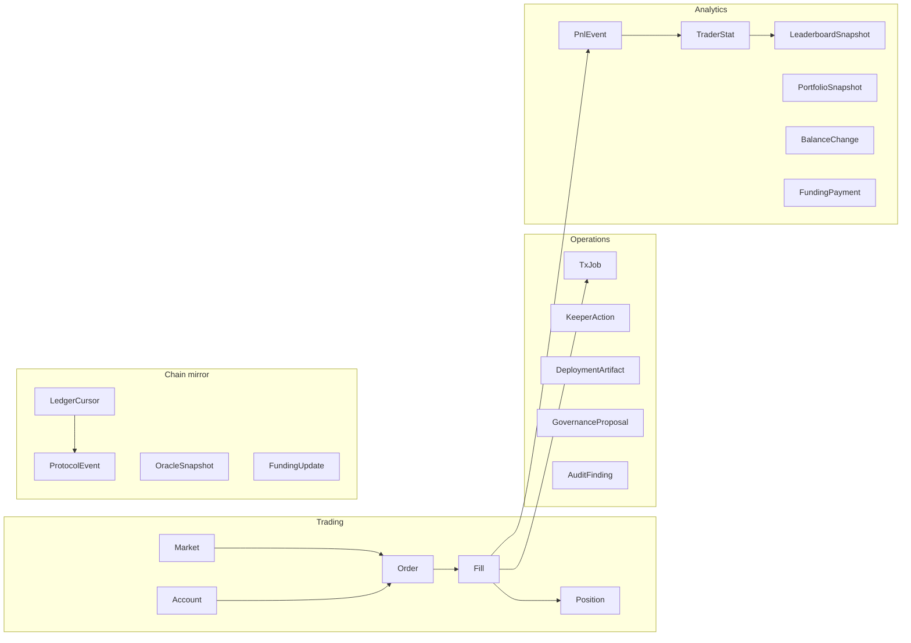
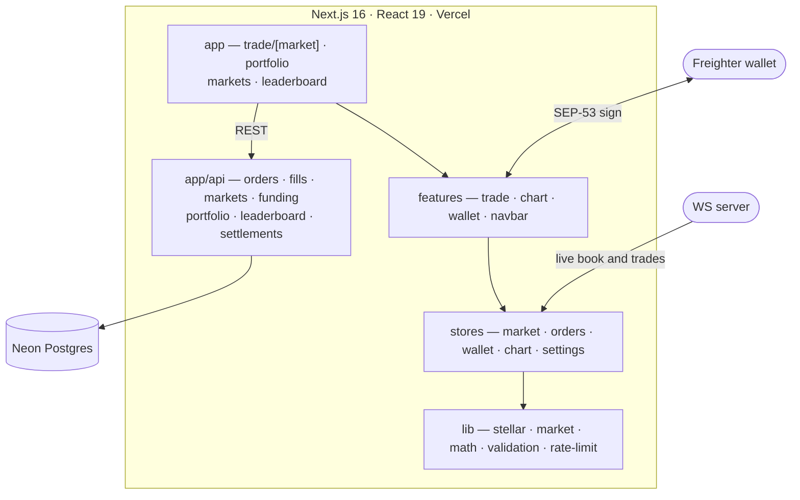
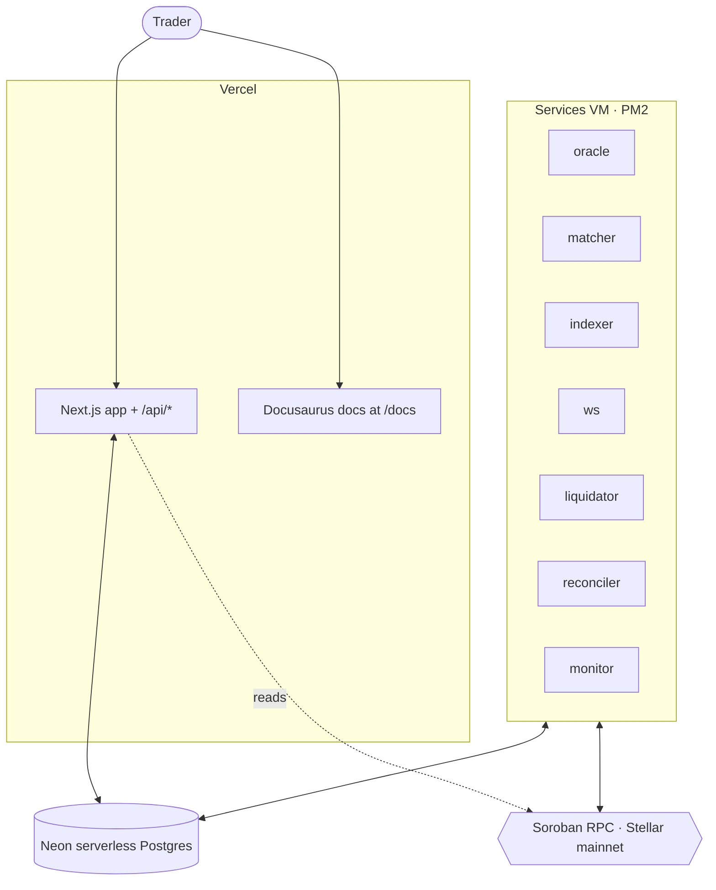
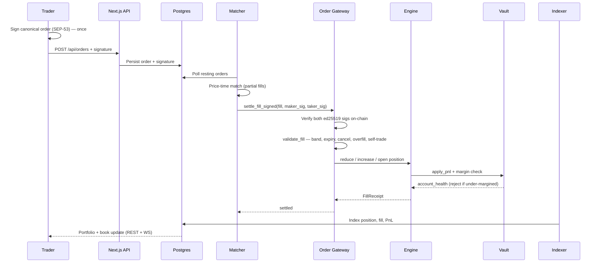

# Kryon Protocol — Architecture

**Kryon is a decentralised perpetual-futures exchange on Stellar/Soroban that
settles every trade on mainnet against self-custodied collateral.** Traders sign
an order once with their own wallet; matching happens off-chain at exchange
speed; custody, margin, funding, and liquidation are enforced entirely by
Soroban contracts that the operator cannot bypass.

The system is a **hybrid CLOB**: a central limit order book off-chain, trustless
settlement on-chain. That split is the whole architecture, and everything below
follows from it.

| | |
| --- | --- |
| **Network** | Stellar mainnet (Soroban) |
| **Collateral** | USDC (Circle SAC), self-custodied in the vault contract |
| **Markets** | XLM-PERP (10x), BTC-PERP (50x), ETH-PERP (20x) |
| **On-chain** | 8 Soroban contracts, `#![no_std]` Rust |
| **Off-chain** | 7 always-on services + Next.js app |
| **User authority** | SEP-53 signatures — the user signs every action that moves their funds |

---

## The full system



The diagram above is the whole protocol in one frame. The rest of this document
walks it **one flow at a time**, then decomposes each layer with its own drawing.

### Reading the diagram

Four colours encode four different **trust properties**, and that is the most
important thing on the page:

| Colour | Flow | Trust property |
| --- | --- | --- |
| 🟢 Green | User-signed (trader authority) | Only the trader's own key can authorise it |
| ⚪ White | Operator-signed settlement | Operator submits, but the **contract** validates |
| 🟡 Amber | Oracle price flow | Quorum median, staleness-guarded |
| ⚫ Dashed | State sync / reads | Read-only; cannot move funds |
| 🔴 Red | Liquidation & insurance | Permissionless trigger, capped reward |

If a line is not green, it cannot move a user's money without contract-enforced
validation. That is the security claim the architecture exists to make.

---

## The ten flows, one by one

### ① Trader signs an intent — `SEP-53 intent`

The trader connects Freighter and places an order. **No transaction is
submitted.** The client builds a canonical order message and asks the wallet to
sign it once:

```
<domain>|place_order|<pubkey_hex>|<market_id>|<is_long 0/1>|<size>|
<limit_price>|<reduce_only 0/1>|<nonce>|<expiry_ts>
```

wrapped per SEP-53 as `sha256("Stellar Signed Message:\n" || message)` — the
32-byte digest the wallet's ed25519 key actually signs.

This one signature commits to market, side, size, limit price, reduce-only flag,
nonce, and expiry. It is what later authorises **every partial fill** of that
order without another wallet popup. The byte layout is pinned on both sides:
`client/lib/market/signing-message.ts` must byte-match `verify_order_signature`
in `kryon-protocol/contracts/perp-order-gateway/src/lib.rs`.

### ② Order lands in the book — `order book write`

`POST /api/orders` validates the payload, verifies the signature shape, and
writes the order plus its signature into Neon Postgres. The book is **off-chain
Postgres, not on-chain state** — an unmatched order costs nothing on-chain,
which is precisely why a CLOB is affordable on Soroban at all.

### ③ Matcher polls the book — `polls open orders`

The matcher service reads resting orders for its markets and runs **price-time
priority** matching with partial fills and market-order book walking. It is
deliberately **single-writer per market** to preserve ordering; horizontal scale
comes from sharding markets across matcher instances, never from two matchers on
one book.

### ④ Settlement — `settle_fill · operator-signed`

For each match the matcher calls the order gateway. The primary path is
**`settle_fill_signed(fill, maker_sig, taker_sig)`**: the operator pays the fee
and submits, and the contract verifies both traders' ed25519 signatures
on-chain. This is what makes settlement **autonomous** — neither trader is
online or prompted.

`validate_fill` then enforces, on-chain, that the operator cannot cheat:

| Check | Rejects |
| --- | --- |
| `fill_size > 0`, `fill_price > 0` | Degenerate fills |
| `maker.owner != taker.owner` | Self-trade |
| `maker.market_id == taker.market_id`, non-zero | Cross-market fills |
| `maker.is_long != taker.is_long` | Direction mismatch |
| `timestamp <= expiry_ts` | Expired orders |
| `!is_cancelled(owner, nonce)` | Cancelled orders |
| `filled(owner, nonce) + fill_size <= size` | **Overfill** |
| long: `fill_price <= limit_price` · short: `fill_price >= limit_price` | Price outside the signed band |

So the operator's power is exactly: *settle a fill that is consistent with what
both traders already signed.* It cannot invent size, worsen price, resurrect a
cancelled order, or fill past the signed quantity.

### ⑤ Gateway drives the engine — `margin checks`

The gateway derives each side's position effect and calls the engine:

- **Opposite position exists** → `reduce_position` up to `min(posSize, fillSize)`;
  any residual `open_position` in the new direction (unless `reduce_only`).
- **Same-side position** → `increase_position` with VWAP entry.
- **No position** → `open_position` (rejected when `reduce_only`).

This is why a market collapses to a **single position row per (trader, market)**
with a volume-weighted entry. The engine then applies fees, updates open
interest and funding indices, and calls `sync_and_require_initial_margin` —
which is where the trade is rejected if margin is insufficient.

### ⑥ Oracle price flow — `median · ~8s`

The oracle keeper pulls spot from **Binance, Coinbase, and Kraken**, takes the
**3-source median**, applies a **USDC de-peg guard**, and writes to the oracle
adapter roughly every 8 seconds. The adapter enforces an
`OracleGuard { max_age_secs, max_confidence_bps }` — the engine refuses to trade
against a stale price (default max age 60s), which is exactly why the keeper's
cadence is 8s and not 60s: it must stay comfortably inside its own staleness
window.

### ⑦ State sync — `positions · OI · funding`

The state indexer streams chain state into Postgres: positions, open interest,
funding, fills, PnL events, balance changes. Everything the UI reads comes from
this projection, **not** from live RPC calls — that is what keeps the terminal
fast. The indexer self-heals missing `Market` rows rather than silently
no-op'ing. The settlement reconciler is its safety net: it recovers stuck or
queued settlements so a dropped RPC never leaves a match unsettled.

### ⑧ Real-time push — WebSocket

The WS server broadcasts orderbook deltas and trades to connected terminals, so
the book updates without polling.

### ⑨ Liquidation — permissionless

The liquidation keeper continuously scans account health. When
`account_health(user, asset).liquidatable` flips true, `perp-liquidation` closes
the position with a **capped reward** (capped so liquidators cannot extract
unbounded value from a distressed trader) and routes the shortfall to
`perp-insurance` as bad debt. Insurance is the backstop fund; the vault's
`absorb_bad_debt` is the last resort.

### ⑩ Deposit / withdraw — user-signed, equity-gated

Collateral movement is always the trader's own signature, straight to the vault.
Withdrawals are **checked against live account equity** — `validate_withdrawal`
rejects any withdrawal that would push the account below its initial-margin
requirement. Traders cannot withdraw collateral out from under an open position.

---

## Layer 1 — On-chain: the Soroban contract suite

Eight `#![no_std]` Rust contracts. The authorisation graph is the design: **each
contract trusts only its authorised caller, never the end user.**



| Contract | LOC | Responsibility |
| --- | --- | --- |
| `perp-engine` | 1261 | Positions, open interest, funding indices, fees, price bands, OI caps |
| `perp-order-gateway` | 1103 | Settlement entry point; signature verification, nonce/overfill/self-trade guards |
| `perp-vault` | 1054 | USDC custody, PnL application, `account_health`, equity-gated withdrawal |
| `perp-oracle-adapter` | 818 | Guarded mark prices; quorum median + staleness rejection |
| `perp-liquidation` | 572 | Under-margined position closure, capped rewards, bad-debt routing |
| `perp-governance` | 367 | 48h timelocked admin over every contract; guardian fast-pause |
| `perp-insurance` | 208 | Bad-debt backstop fund |
| `perp-risk` | 124 | Risk-parameter source consulted by the engine |

**Deployed on Stellar mainnet.** Every address below is live on the public
network, and its on-chain wasm hash matches the recorded build in
`kryon-protocol/infra/deploy/mainnet-deployment.json`:

| Contract | Address |
| --- | --- |
| Engine | `CD6OMHCRDDBDO7I57HCUU52RORFPP7DUIRULWFBOX5WLCO5H2OB3W6LZ` |
| Order Gateway | `CBA2PSRHSIFTSUAFZWMF6CARNO7YR52PWLWLEXYVRACORS2RXNO2DUTJ` |
| Vault | `CDXGTJQS3XLGXSWDUHKMS5PBBFRRKRXRWH3HTBFNXBIAYEZNDTDKLR4J` |
| Oracle Adapter | `CD3ZFYZPLJ6W2KO6HD7HE5P5Q27M5N6ITUPHQDRP23NBIVKE6WTUY25F` |
| Liquidation | `CBGSXCZTZOSBMM5RLGZWWLE2USNAXL5ZKCHTZQ6DOKBD3PIEUJXFYDRO` |
| Insurance | `CCBEJ3F2PUV5OA4JNX3CPSOJFQMYMFDPLNANR2GJZVQEEBFMB6JYNL54` |
| Risk | `CBHZWEIKXULFIH6DCSS7W6BJ3YUVQ5TJFYPP4UKQC4NKLNAF7VLPNVUI` |
| Governance | `CDSIEH7UZ62BT523G3RGJQGJHE7AI4EV265ESKZB672GTIEZNBYPYDXU` |

Settlement assets: USDC (Circle SAC)
`CCW67TSZV3SSS2HXMBQ5JFGCKJNXKZM7UQUWUZPUTHXSTZLEO7SJMI75`, native XLM SAC
`CAS3J7GYLGXMF6TDJBBYYSE3HQ6BBSMLNUQ34T6TZMYMW2EVH34XOWMA`.

Two design properties worth stating explicitly:

- **Cross-margin at the vault.** Margin is held at the vault account level, not
  per position. `position.margin` is always `0` — never read it. Leverage and
  liquidation price derive from account equity.
- **Guardian pause.** `emergency_pause` is callable by admin **or** guardian;
  `unpause` is admin-only. Once admin sits behind the 48h timelock, the guardian
  is the fast path to stop settlement without waiting out the timelock.

## Layer 2 — Shared Rust core

The contracts are thin. The money math lives in three shared crates,
unit-testable without a chain:



- **`protocol-core/fixed.rs`** — the arithmetic floor. `PRECISION = 1e18`,
  `BPS_DENOMINATOR = 10_000`, and *checked* `checked_add/sub/mul/div`,
  `mul_div`, `mul_precision`, `div_precision`, `apply_bps`, `ceil_div`. Every
  monetary operation in the protocol goes through these — there is no raw `+`
  on money anywhere in the contracts.
- **`risk-engine/margin.rs`** — `account_health`, `validate_withdrawal`,
  `max_leverage_bps`. One implementation of margin, shared by the engine, the
  vault, and the liquidation contract, so the three can never disagree.
- **`risk-engine/funding.rs`** — `update_from_imbalance`: funding rate from
  long/short open-interest imbalance.
- **`risk-engine/liquidation.rs`** — `plan_liquidation`: what to close, and what
  the liquidator is owed.

## Layer 3 — Off-chain services

Seven always-on Node processes under PM2 (`client/ecosystem.config.cjs`). These
hold signing keys and run loops, so they are **workers, never serverless
functions**.



| Service | Script | Loop |
| --- | --- | --- |
| Oracle keeper | `scripts/oracle-keeper.ts` | Fetch → median → de-peg guard → `write_price` every ~8s |
| Matcher | `scripts/matcher-service.ts` | Poll book → price-time match → `settle_fill_signed` → book realized PnL |
| State indexer | `scripts/state-indexer.ts` | Chain → Postgres; leaderboard & portfolio aggregation |
| WS server | `scripts/ws-server.ts` | Broadcast orderbook deltas + trades (port 8080) |
| Liquidation keeper | `scripts/liquidation-keeper.ts` | Scan `account_health`; trigger liquidation; contract TTL keepalive |
| Settlement reconciler | `scripts/settlement-reconciler.ts` | Re-drive stuck/queued settlements |
| Monitor | `scripts/monitor.ts` | Alert on stale oracle, bad debt, settlement failures |

**Why the reconciler exists.** Settlement is a chain write and chain writes fail
— RPC timeouts, sequence contention, congestion. Without a reconciler a dropped
submission leaves a match recorded off-chain but unsettled on-chain, and the two
views of the world diverge. The reconciler makes settlement **eventually
consistent** rather than best-effort.

**Why the keeper needs TTL keepalive.** Soroban state expires. The keeper bumps
contract instance TTL (`extend_instance_ttl`) so a quiet market cannot silently
archive protocol state.

## Layer 4 — Data

Neon serverless Postgres, schema in `kryon-protocol/prisma/schema.prisma` (27
models). It is the **off-chain projection**, never the source of truth for
funds:



Key roles:

- **`Order` / `Fill` / `Position`** — the book and its outcomes; `Order` carries
  the SEP-53 signature that later authorises settlement.
- **`LedgerCursor` / `ProtocolEvent`** — indexer checkpointing, so a restart
  resumes rather than re-ingests.
- **`TxJob`** — the settlement work queue the reconciler drains; `TxStatus`
  tracks each chain write.
- **`PnlEvent` / `BalanceChange` / `FundingPayment`** — the audit trail behind
  every number in the portfolio UI.
- **`TraderStat` / `LeaderboardSnapshot`** — pre-aggregated so the leaderboard is
  a read, not a scan.

## Layer 5 — Application



- **Pages** — `trade/[market]`, `portfolio`, `markets`, `leaderboard`, landing.
- **API routes** — `/api/orders` (+ `/cancel`), `/api/fills`, `/api/markets/[id]`
  (+ `/orderbook`, `/trades`, `/candles`), `/api/portfolio/[address]`,
  `/api/leaderboard`, `/api/funding`, `/api/settlements` (+ `/[id]/sign`),
  `/api/health`, `/api/ready`. Stateless — they scale horizontally.
- **State** — Zustand stores for market/orders/wallet/chart/settings; TanStack
  Query for server state.
- **Charting** — TradingView chart in `features/chart`, fed by `/candles`.
- **Rate limiting & validation** — `lib/rate-limit.ts`, `lib/validation.ts` on
  every write route.

## Layer 6 — Infrastructure



- **Frontend + API + docs** — one Vercel deployment; docs build into
  `public/docs` on push to `main`.
- **Services** — a single always-on VM under PM2, one process per service, with
  restart-on-exit and signing keys injected from the environment rather than
  committed.
- **Database** — Neon serverless Postgres with connection caching and
  `withRetry` for transient errors.
- **Chain** — Soroban RPC against Stellar mainnet.

---

## End-to-end: one trade



The trader signed **once**, at the start. Everything after that is autonomous,
and every step that touches money is validated by a contract.

## Trust boundaries

| Actor | Can do | **Cannot** do |
| --- | --- | --- |
| **Trader** | Deposit, withdraw (equity-gated), sign orders, cancel orders | Withdraw below initial margin |
| **Operator (matcher)** | Submit fills consistent with signed orders | Move funds; overfill; fill outside the signed price band; fill expired or cancelled orders; self-trade |
| **Oracle keeper** | Write guarded prices | Publish stale or out-of-confidence prices past the guard |
| **Liquidator** | Trigger liquidation on unhealthy accounts | Liquidate a healthy account; claim uncapped reward |
| **Guardian** | Emergency-pause settlement | Unpause; change parameters |
| **Admin/governance** | Change parameters, upgrade | Act instantly — 48h timelock |

The honest statement of the residual trust: **the operator is a liveness
dependency, not a custody one.** If the matcher stops, trading stops. It can
never take a user's funds, and it can never settle a fill the user did not
already sign for.

---

## Repository map

```
Kryon/
├── kryon-protocol/
│   ├── contracts/          # 8 Soroban contracts (Rust, no_std)
│   │   ├── perp-engine/            positions · funding · OI · fees
│   │   ├── perp-order-gateway/     settlement + signature verification
│   │   ├── perp-vault/             USDC custody · account_health
│   │   ├── perp-oracle-adapter/    guarded mark prices
│   │   ├── perp-liquidation/       capped-reward liquidation
│   │   ├── perp-insurance/         bad-debt backstop
│   │   ├── perp-risk/              risk parameters
│   │   └── perp-governance/        48h timelock · guardian
│   ├── crates/             # shared math: protocol-core · risk-engine
│   ├── prisma/schema.prisma# 27 models
│   └── infra/
├── client/
│   ├── app/                # Next.js pages + /api routes
│   ├── features/           # trade · chart · wallet · navbar
│   ├── stores/ · lib/      # Zustand state · Stellar/signing/math helpers
│   ├── scripts/            # the 7 PM2 services + deploy/ops scripts
│   └── ecosystem.config.cjs
└── docs/                   # Docusaurus documentation site
```

## Further reading

- [Protocol Architecture](docs/docs/architecture/protocol.md) — the hybrid-CLOB rationale
- [Contracts](docs/docs/architecture/contracts.md) — per-function contract reference
- [Frontend](docs/docs/architecture/frontend.md) ·
  [Backend](docs/docs/architecture/backend.md) ·
  [Infrastructure](docs/docs/architecture/infra.md)
- [Order Lifecycle](docs/docs/trading/order-lifecycle.md) ·
  [PnL & Funding](docs/docs/trading/pnl-funding.md)
